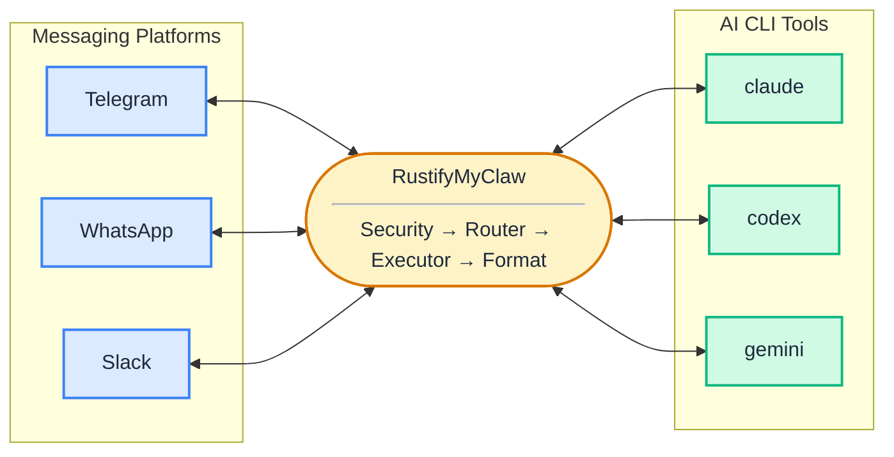
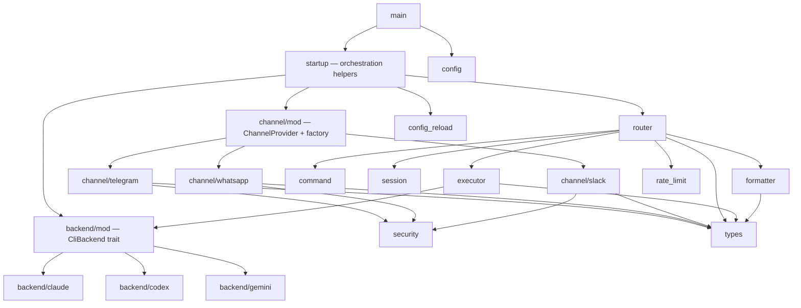

# Architecture

RustifyMyClaw is a Rust daemon that bridges messaging platforms to local AI CLI tools. A message arrives on a channel, flows through a fixed pipeline, and the CLI's output goes back to the originating chat. The daemon is a dumb pipe — no web UI, no database, no PTY, no concurrency management.

## System Overview



## Components

**Config Loader** (`src/config.rs`) — Reads `~/.rustifymyclaw/config.yaml` at startup, replaces `${VAR}` patterns with environment variables, validates the result, and exposes typed structs to the rest of the program. Also handles config hot-reload diffing via `diff_reload()`.

**SecurityGate** (`src/security.rs`) — One instance per channel. Holds a `HashSet<String>` of resolved, platform-native user IDs. Every inbound message is checked here before entering the pipeline. Unauthorized messages are silently dropped.

**SessionStore** (`src/session.rs`) — A `HashMap<ChatId, SessionState>` shared behind `Arc<RwLock<>>`. Sessions are keyed by `ChatId` which includes the channel kind, preventing collisions between e.g. Telegram chat `12345` and WhatsApp chat `12345`.

**Router** (`src/router.rs`) — Receives `InboundMessage` from channel providers via a bounded `mpsc` channel. Parses the `BridgeCommand`, handles `/new`, `/use`, `/status`, `/help` directly, and dispatches `Prompt` messages to the executor. Applies rate limiting before dispatch. Handles graceful drain on shutdown.

**Executor** (`src/executor.rs`) — Spawns the CLI process via `tokio::process::Command`, pipes stdin/stdout/stderr, and enforces a per-workspace timeout. Returns a raw `CliResponse` — no interpretation.

**Formatter** (`src/formatter.rs`) — Splits CLI output into message-sized chunks using either the `Natural` strategy (code block → paragraph → line → sentence boundaries) or `Fixed` strategy (hard cut). If total output exceeds `file_upload_threshold_bytes`, skips chunking and uploads as a file instead. All string slicing uses `char_boundary_floor()` for UTF-8 safety.

**RateLimiter** (`src/rate_limit.rs`) — Per-user sliding window. Keyed by `user_id` string, backed by a `VecDeque<Instant>` per user. Returns `Allowed` or `LimitedFor(Duration)`.

**ConfigReload** (`src/config_reload.rs`) — File watcher using the `notify` crate. Debounced at 300ms. On change: reloads config, calls `diff_reload()` to log what changed, then invokes a callback. Rate limits apply immediately; workspace and channel changes require a restart.

## Data Flow

A message from Telegram to a response back:

1. `TelegramProvider` receives an update via teloxide long-polling.
2. `SecurityGate` checks `user_id` against the channel's `allowed_users` set. If not allowed, drop silently.
3. Provider stamps an `InboundMessage` with `MessageContext` (workspace `Arc`, provider `Arc`, effective output config) and sends it on the `mpsc` channel.
4. `Router` receives the message and calls `BridgeCommand::parse(&msg.text)`.
5. If it's `/new`, `/status`, `/help`, or `/use` — handle directly and respond via `msg.context.provider.send_response()`.
6. If it's a `Prompt`, check rate limit. If limited, send a "try again in N seconds" reply.
7. Read session state from `SessionStore`. Call `CliBackend::build_command()` to construct the `tokio::process::Command`.
8. `Executor` spawns the process, captures stdout/stderr, enforces timeout. Returns `CliResponse`.
9. `Formatter` chunks the output according to `msg.context.output_config`. Produces `FormattedResponse`.
10. `msg.context.provider.send_response()` delivers each chunk back to the originating chat.
11. `SessionStore` marks the session active.

## Module Dependencies



## Design Decisions

| Decision | Choice | Rationale |
|----------|--------|-----------|
| Concurrency model | Dumb pipe — no CLI-level locking | CLI backends own their own locking. RustifyMyClaw faithfully returns whatever the CLI outputs. |
| Session identity | `ChatId` includes `ChannelKind` | Prevents collisions between the same numeric ID on different platforms. |
| Routing info delivery | Stamped on `InboundMessage` at ingestion via `MessageContext` | Router needs no lookup tables. Each message carries its workspace, provider, and output config. |
| Workspace sharing | `Arc<WorkspaceHandle>` (V1), `Arc<RwLock<WorkspaceHandle>>` (V2) | Enables runtime workspace switching via `/use` without restarting listeners. |
| Channel `start()` signature | `&self` + separate `self_arc: Arc<dyn ChannelProvider>` argument | Polling closures need owned captures. A borrow doesn't live long enough; passing `Arc` explicitly avoids self-referential struct construction. |
| Backend instantiation | One instance per distinct backend name, stored in `HashMap<String, Arc<dyn CliBackend>>` | No duplicate allocations when multiple workspaces share a backend. |
| Config hot-reload | Rate limits apply immediately; all other changes require restart | Channel connections and security gates are constructed once at startup. Hot-patching them adds complexity without much operational value. |
| Channel construction | `ChannelProviderFactory` trait + `channel::build()` dispatch | Each provider owns its config validation and user resolution. `main.rs` calls a single factory function per channel. |

## Extension Points

### Adding a new backend

See the step-by-step checklist in `CLAUDE.md`. The key interface is `CliBackend` in `src/backend/mod.rs`:

```rust
pub trait CliBackend: Send + Sync {
    fn build_command(&self, prompt: &str, working_dir: &Path, session: &SessionState) -> Command;
    fn parse_output(&self, stdout: String, stderr: String, exit_code: i32, duration: Duration) -> CliResponse;
    fn name(&self) -> &'static str;
}
```

Add a match arm to `build()` in `src/backend/mod.rs` and the name to `KNOWN_BACKENDS` in `src/config.rs`.

### Adding a new channel provider

See the step-by-step checklist in `CLAUDE.md`. The key interfaces are `ChannelProvider` and `ChannelProviderFactory` in `src/channel/mod.rs`:

```rust
pub trait ChannelProvider: Send + Sync {
    async fn start(
        &self,
        tx: mpsc::Sender<InboundMessage>,
        self_arc: Arc<dyn ChannelProvider>,
        shutdown: CancellationToken,
    ) -> Result<()>;
    async fn send_response(&self, chat_id: &ChatId, response: FormattedResponse) -> Result<()>;
}

pub trait ChannelProviderFactory: ChannelProvider + Sized {
    async fn create(
        ch_config: &ChannelConfig,
        workspace: Arc<RwLock<WorkspaceHandle>>,
        global_output: &Arc<OutputConfig>,
    ) -> Result<Arc<dyn ChannelProvider>>;
}
```

Each provider module defines a `resolve_users` function (free function, not a trait method) to convert `AllowedUser` config entries into platform-native ID strings:

- **Telegram** (`telegram::resolve_users`) — synchronous. Strips `@` prefix, lowercases handles.
- **WhatsApp** (`whatsapp::resolve_users`) — synchronous. Passes phone numbers through, warns on numeric IDs.
- **Slack** (`slack::resolve_users`) — async. Passes raw user IDs (`U…`/`W…`) through, hits `users.list` API for handle resolution.

`ChannelProviderFactory::create()` calls the module's `resolve_users` function, builds `SecurityGate::new(resolved)`, computes the effective output config, then constructs the provider once. No temporary instances, no dummy gates.

The `self_arc` parameter on `start()` exists because polling closures need owned captures of the provider. Pass it through to any closure that stamps `MessageContext`.

`channel::build()` dispatches by kind string and is the single entry point called from `startup::build_workspaces()`.

### Adding a new command

Add a variant to `BridgeCommand` in `src/command/mod.rs` and handle it in the match block in `src/router.rs`. Commands that require executor dispatch follow the `Prompt` path; commands that respond immediately short-circuit before reaching the executor.
