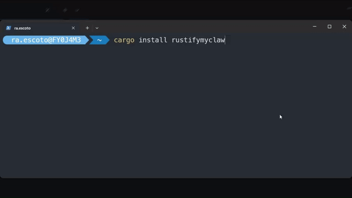

# Demo: Setting Up RustifyMyClaw



I began this project to interact with my Claude Code coach `Coach-Claudio`, which I am starting from scratch on [GitHub/Escoto/Coach-Claudio](https://github.com/Escoto/Coach-Claudio).

## Pre-Requisites

- Rust
- Cargo
- Claude Code
- Telegram Bot (and token)
    1. **Find and Start BotFather**, open Telegram and search for @BotFather (look for the verified blue checkmark). Click Start to begin the interaction.

    2. **Generate Your Bot**, send the command /newbot. BotFather will ask you for two things:
        - **Display Name**: The name users see (e.g., My Helper Bot).
        - **Username**: A unique handle that must end in "bot" (e.g., helper_123_bot).

    3. **Save Your API Token**, once the username is accepted, BotFather will send a success message containing your HTTP API Token.

    > [!CAUTION]
    > Keep this token secret. It is the key to controlling your bot and
    > connecting it to any software or code you write.

## Steps

Follow these steps to set up your own config file rather than using the system default.

> This demo uses `cargo install`, but any [install method](../../../README.md#1-install) works — pick whichever you're most comfortable with.

### 1. Install

```sh
cargo install rustifymyclaw
```

### 2. Verify installation

```sh
rustifymyclaw --version
```

### 3. Generate a config file

```sh
rustifymyclaw config init -d .
```

### 4. Edit the config

```sh
nano ./config.yaml
```

See the example config: [config.yaml](config.yaml)

### 5. Validate

```sh
rustifymyclaw --validate -f ./config.yaml
```

### 6. Run

```sh
rustifymyclaw -f ./config.yaml
```